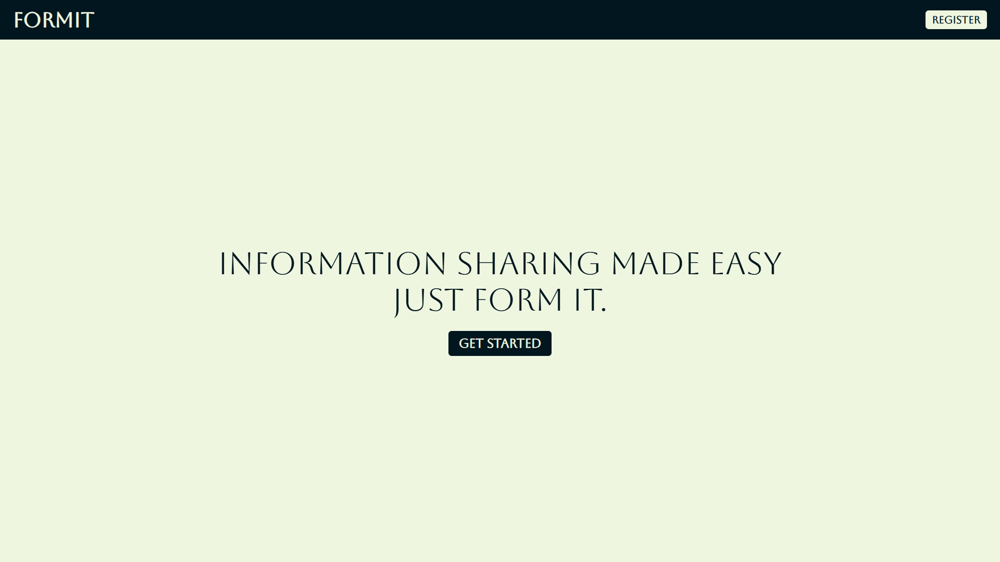
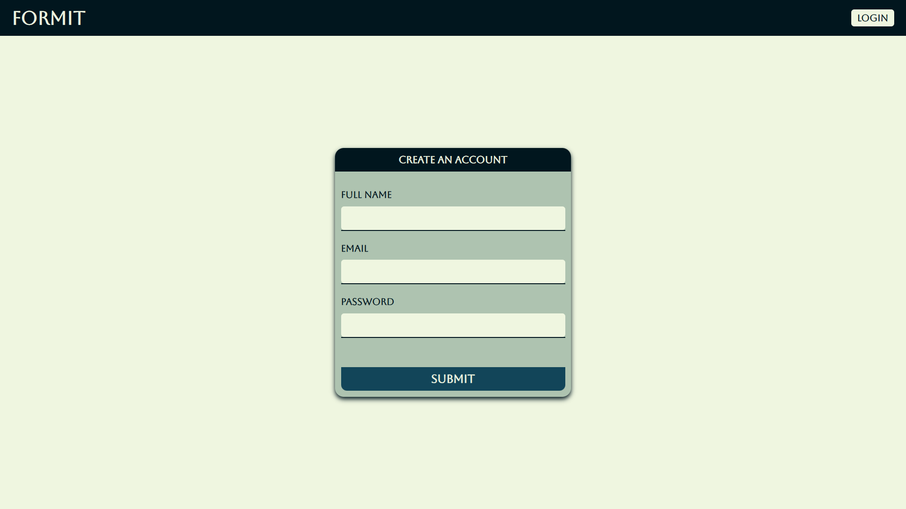
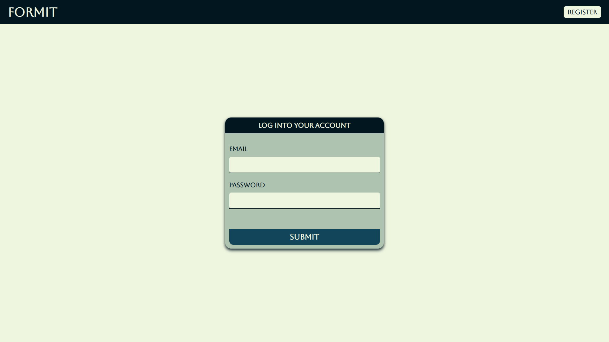
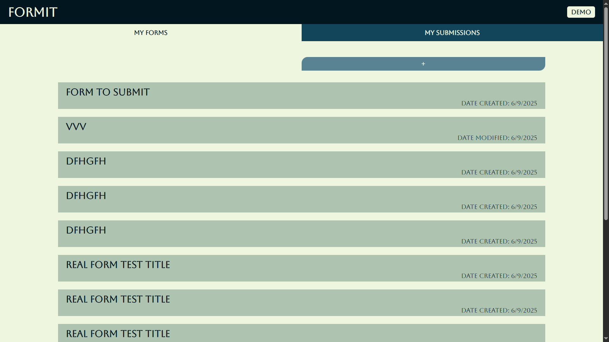
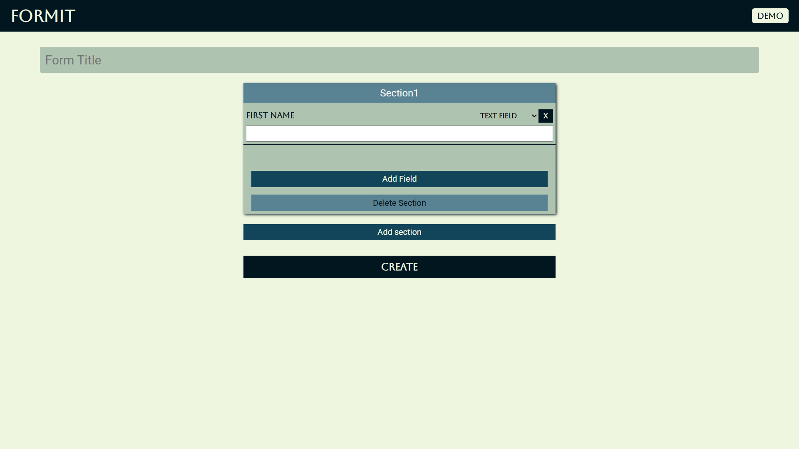
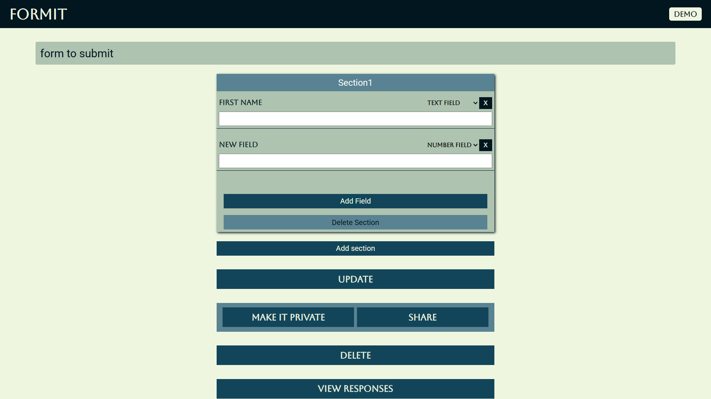
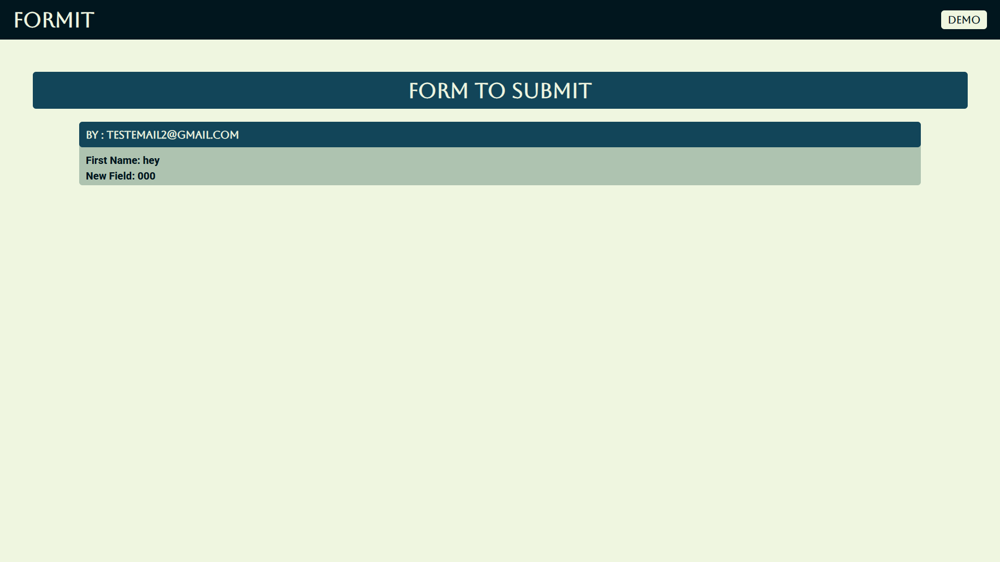
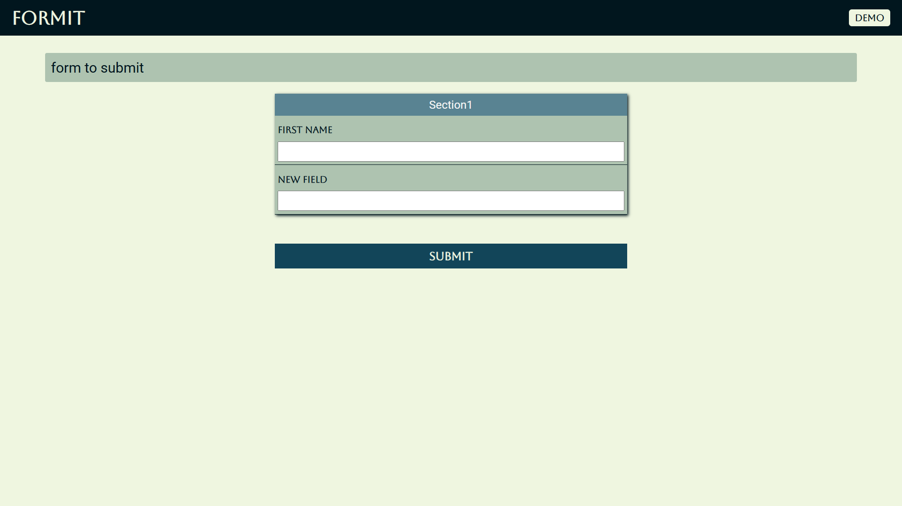
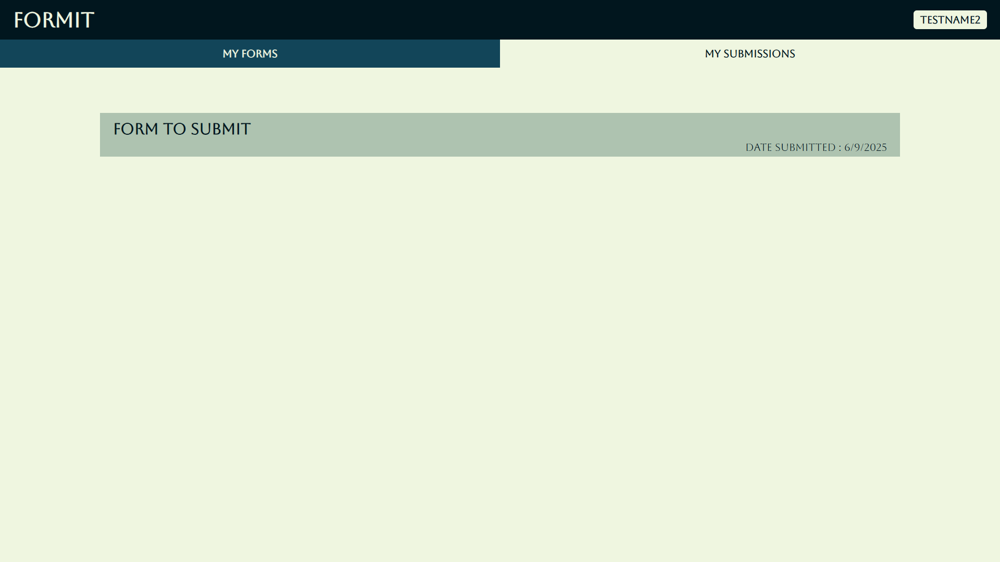
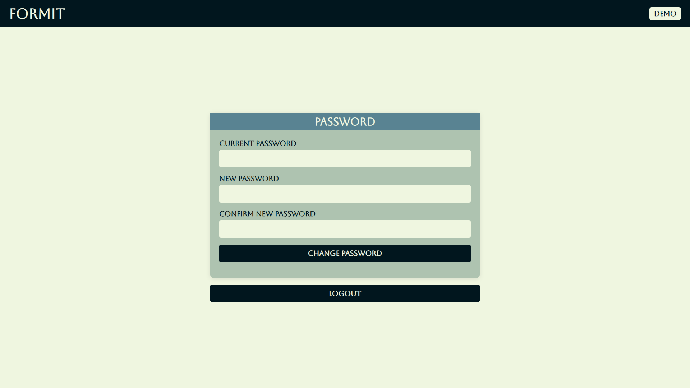

# FormIt

FormIt is a comprehensive project designed to simplify and streamline form creation, management, and data collection. This README provides an overview of the project, its features, and a step-by-step guide to set up and run FormIt on your local device.

---

## Table of Contents

-   [Features](#features)
-   [Tech Stack](#tech-stack)
-   [Project Structure](#project-structure)
-   [Prerequisites](#prerequisites)
-   [Project Setup](#project-setup-on-your-local-device)
-   [Running the Project](#running-the-project)
-   [Usage](#usage)
-   [Screenshots](#screenshots)
-   [Contributing](#contributing)
-   [License](#license)

---

## Features

-   User-friendly form builder interface
-   Create forms
-   Edit forms
-   Share forms with others to submit
-   Submit forms shared by others
-   View Responses

---

## Tech Stack

-   **Frontend:** React.js
-   **Backend:** Node.js, Express.js
-   **Database:** MongoDB
-   **Styling:** CSS

---

## Project Structure

```
/FormIt
│
├── Backend/           # Backend source code
├── client/           # Frontend source code
├── README.md         # Project documentation
└── ...
```

---

## Prerequisites

-   [Node.js](https://nodejs.org/)
-   [npm](https://www.npmjs.com/)
-   [Git](https://git-scm.com/downloads)

---

## Project Setup On Your Local Device

1. **Clone the repository:**

    ```bash
    git clone https://github.com/Haseeb-U/FormIt.git
    cd FormIt
    ```

2. **Install dependencies for backend:**

    ```bash
    npm run install-server
    ```

3. **Install dependencies for frontend:**

    ```bash
    cd Backend
    npm run install-client
    ```

4. **Create .env file:**
    - Go to backend folder
    - Create a file named .env with following content
    ```bash
    MONGO_DB_URL=#YOUR_MONGO_DB_URL_HERE
    MONGO_DB_NAME=#YOUR_MONGO_DB_NAME_HERE
    JWT_SECRET=#YOUR_JWT_SECRET_HERE
    ```
    - Replace comments with your respective details

---

## Running the Project

1. **Start server:**

    ```bash
    cd Backend
    npm run dev
    ```

2. **Access the application:**
    - Client server is running at `http://localhost:5173/`
    - Backend server is running at `http://localhost:5000`
    - Open your browser and navigate to `http://localhost:5173/`

---

## Usage

-   Register or log in to your account.
-   Create a new form.
-   Add, remove, or customize fields as needed.
-   Save or update form.
-   Make your form public to share with others.
-   Share your form.
-   View collected responses.

---

## Screenshots

### Home Page



### Signup Page



### Login Page



### My Forms Page



### Create Form Page



### Update Form Page



### View Responses Page



### Submit Form Page



### My Submissions Page



### Profile Settings Page



---

## Contributing

Contributions are welcome! Please fork the repository and submit a pull request.

---

## License

This project is licensed under the [MIT License](LICENSE).

---

**For any issues or questions, please open an issue on GitHub.**
